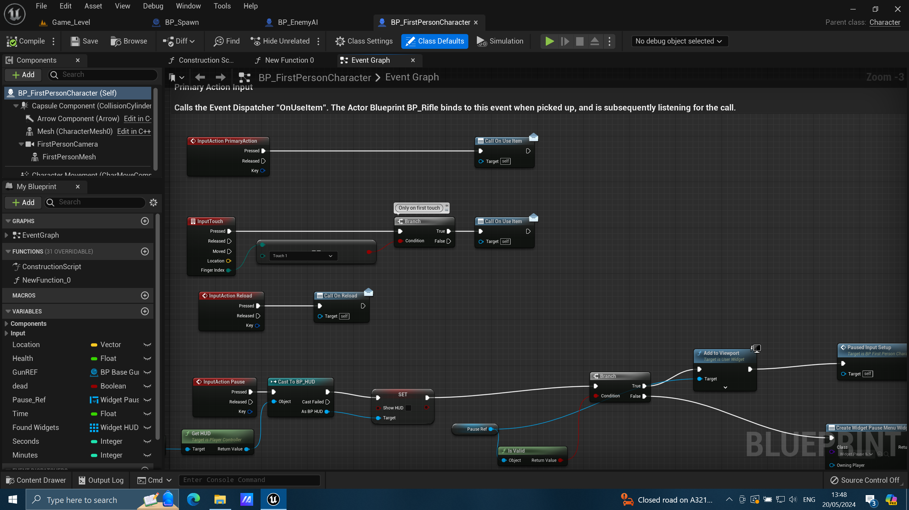

# KoD (Kill or DIE)

## Shooting game build with `Unreal` game engine

# Features of the game:
- Maintaining and displaying start screen/ pause screen /  scores
- Artificial intelligence for enemies
- Collision detection and interaction with background
- Collision Detection between Actors
- Movement, aiming and shooting for player and enemies

## Images:

### Map view
   

### Blueprints
   

### Player's perspective view
   
